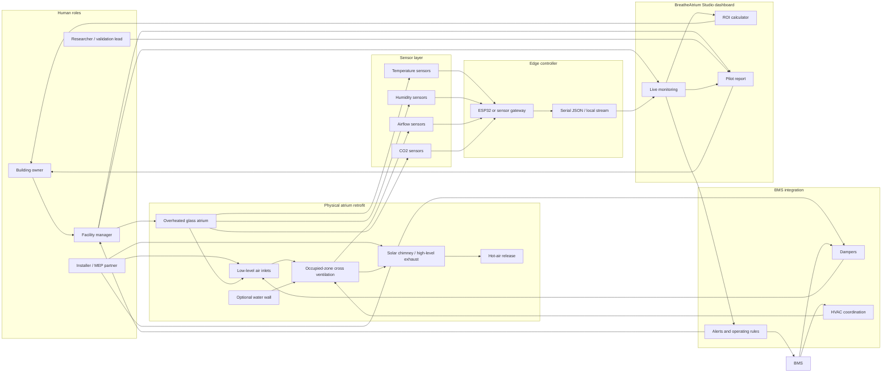
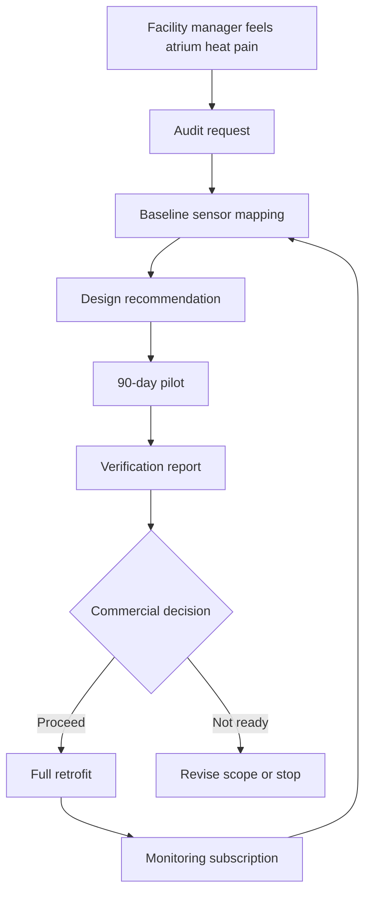
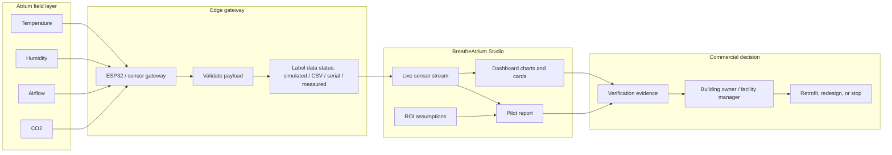

# BreatheAtrium System Architecture

BreatheAtrium is a mixed-mode atrium retrofit. The passive system moves air; the sensor system proves what happened; the dashboard turns the pilot into a commercial decision.

The architecture has four connected layers:

- **Physical retrofit:** low-level air inlets, occupied-zone cross-flow, solar chimney or high-level exhaust, hot-air release, and optional water wall.
- **Sensor and edge layer:** temperature, humidity, airflow, and CO2 readings collected through an ESP32 or simple sensor gateway.
- **Operations layer:** live monitoring, BMS coordination, damper/HVAC handoff, alerts, ROI assumptions, and pilot reporting.
- **Human workflow:** facility manager, installer, researcher, and building owner each get a clear role.

## System Diagram

**Explanation:** the passive architecture creates the airflow path, while the sensor gateway gives the dashboard enough evidence to show what changed. BMS integration keeps BreatheAtrium positioned as a mixed-mode system that coordinates with HVAC rather than pretending to replace it.

Source file: `docs/architecture/system-architecture.mmd`

## User Flow

**Explanation:** the buyer path is deliberately conservative. BreatheAtrium starts with the facility manager's pain, converts that pain into an audit, proves the intervention in a 90-day pilot, then asks for a full retrofit only after a verification report.

Source file: `docs/architecture/user-flow.mmd`

## Data Flow

**Explanation:** the demo can use simulated or CSV data, while pilot deployments can use serial or measured sensor data. Every data path must preserve status labels so simulated assumptions are never confused with measured pilot evidence.

Source file: `docs/architecture/data-flow.mmd`

## Presentation Notes

- Lead with the physical airflow path: inlet, occupied-zone cross-flow, solar-assisted exhaust, high-level release.
- Then show measurement: sensors, gateway, dashboard, pilot report.
- Close with commercialization: facility pain becomes an audit, pilot, verification report, retrofit, and monitoring subscription.
- Keep the claim disciplined: BreatheAtrium reduces heat build-up and cooling burden where site conditions support it; results require measurement.
